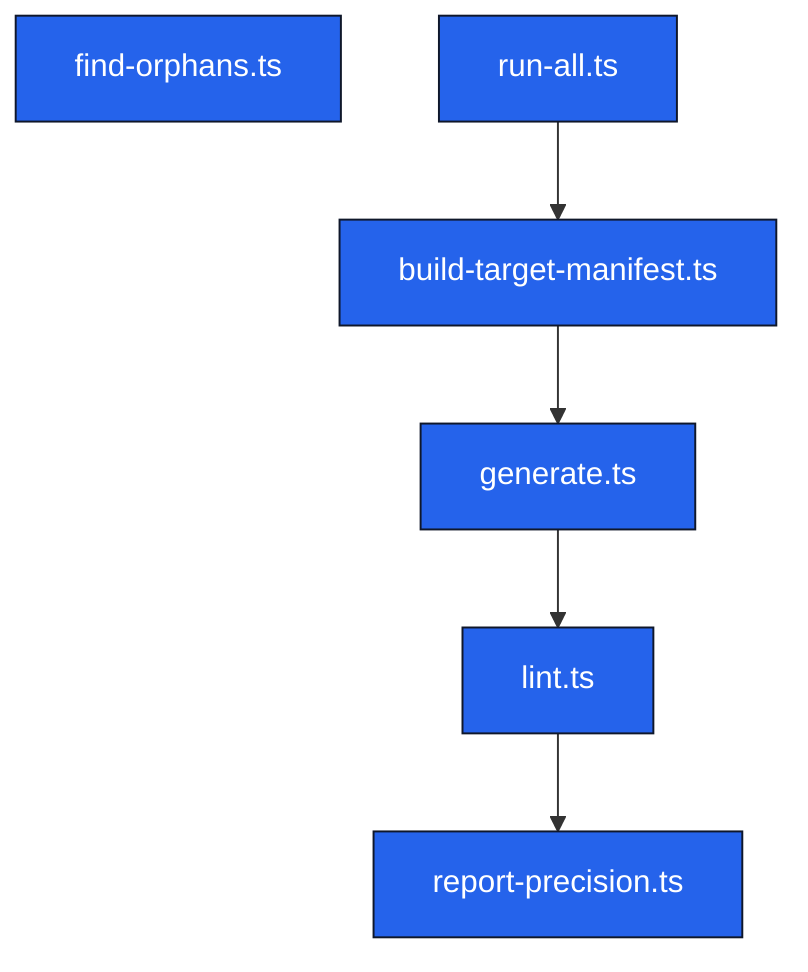

# COMP-scriptslivedocs – Live Docs Component

## Metadata
- Layer: 3
- Archetype: component
- Live Doc ID: COMP-scriptslivedocs
- Generated At: 2025-11-11T03:38:40.692Z

## Authored
### Purpose
_Pending authored purpose_

### Notes
_Pending notes_

## Generated
<!-- LIVE-DOC:PROVENANCE {"generators":[{"tool":"live-docs-system-generator","version":"0.1.0","generatedAt":"2025-11-11T03:38:40.692Z"}]} -->
<!-- LIVE-DOC:BEGIN Components -->
### Components
- [scripts/live-docs/build-target-manifest.ts](../../source/scripts/live-docs/build-target-manifest.ts.mdmd.md)
- [scripts/live-docs/find-orphans.ts](../../source/scripts/live-docs/find-orphans.ts.mdmd.md)
- [scripts/live-docs/generate.ts](../../source/scripts/live-docs/generate.ts.mdmd.md)
- [scripts/live-docs/lint.ts](../../source/scripts/live-docs/lint.ts.mdmd.md)
- [scripts/live-docs/report-precision.ts](../../source/scripts/live-docs/report-precision.ts.mdmd.md)
- [scripts/live-docs/run-all.ts](../../source/scripts/live-docs/run-all.ts.mdmd.md)
<!-- LIVE-DOC:END Components -->

<!-- LIVE-DOC:BEGIN Topology -->
### Topology

<!-- LIVE-DOC:END Topology -->
