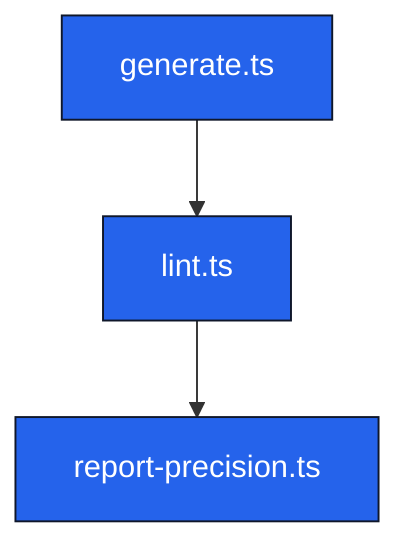

# INT-scriptslivedocslintts – Lint.ts Interaction

## Metadata
- Layer: 3
- Archetype: interaction
- Live Doc ID: INT-scriptslivedocslintts
- Generated At: 2025-11-11T03:49:33.720Z

## Authored
### Purpose
_Pending authored purpose_

### Notes
_Pending notes_

## Generated
<!-- LIVE-DOC:PROVENANCE {"generators":[{"tool":"live-docs-system-generator","version":"0.1.0","generatedAt":"2025-11-11T03:49:33.720Z"}]} -->
<!-- LIVE-DOC:BEGIN Components -->
### Components
- [scripts/live-docs/generate.ts](../../source/scripts/live-docs/generate.ts.mdmd.md)
- [scripts/live-docs/lint.ts](../../source/scripts/live-docs/lint.ts.mdmd.md)
- [scripts/live-docs/report-precision.ts](../../source/scripts/live-docs/report-precision.ts.mdmd.md)
<!-- LIVE-DOC:END Components -->

<!-- LIVE-DOC:BEGIN Topology -->
### Topology

<!-- LIVE-DOC:END Topology -->
