# TEST-live-docs-coverage – Live Docs Coverage

## Metadata
- Layer: 3
- Archetype: testing
- Live Doc ID: TEST-live-docs-coverage
- Generated At: 2025-11-11T05:12:48.920Z

## Authored
### Purpose
_Pending authored purpose_

### Notes
_Pending notes_

## Generated
<!-- LIVE-DOC:PROVENANCE {"generators":[{"tool":"live-docs-system-generator","version":"0.1.0","generatedAt":"2025-11-11T05:12:48.920Z"}]} -->
<!-- LIVE-DOC:BEGIN Components -->
### Components
- [packages/server/src/features/live-docs/evidenceBridge.ts](../../source/packages/server/src/features/live-docs/evidenceBridge.ts.mdmd.md)
- [packages/server/src/features/live-docs/generation/core.ts](../../source/packages/server/src/features/live-docs/generation/core.ts.mdmd.md)
- [packages/server/src/features/live-docs/generator.test.ts](../../source/packages/server/src/features/live-docs/generator.test.ts.mdmd.md)
- [packages/server/src/features/live-docs/generator.ts](../../source/packages/server/src/features/live-docs/generator.ts.mdmd.md)
- [packages/server/src/features/live-docs/renderPublicSymbolLines.test.ts](../../source/packages/server/src/features/live-docs/renderPublicSymbolLines.test.ts.mdmd.md)
- [packages/server/src/features/live-docs/system/generator.test.ts](../../source/packages/server/src/features/live-docs/system/generator.test.ts.mdmd.md)
- [packages/server/src/features/live-docs/system/generator.ts](../../source/packages/server/src/features/live-docs/system/generator.ts.mdmd.md)
- [packages/shared/src/live-docs/generator.test.ts](../../source/packages/shared/src/live-docs/generator.test.ts.mdmd.md)
- [packages/shared/src/live-docs/markdown.ts](../../source/packages/shared/src/live-docs/markdown.ts.mdmd.md)
- [packages/shared/src/live-docs/schema.test.ts](../../source/packages/shared/src/live-docs/schema.test.ts.mdmd.md)
- [packages/shared/src/live-docs/schema.ts](../../source/packages/shared/src/live-docs/schema.ts.mdmd.md)
<!-- LIVE-DOC:END Components -->

<!-- LIVE-DOC:BEGIN Topology -->
### Topology

```mermaid
graph TD
  node_doc_packagesserversrcfeatureslivedocsevidencebridgets["evidenceBridge.ts"]
  click node_doc_packagesserversrcfeatureslivedocsevidencebridgets "../../source/packages/server/src/features/live-docs/evidenceBridge.ts.mdmd.md" "evidenceBridge.ts"
  node_doc_packagesserversrcfeatureslivedocsgenerationcorets["core.ts"]
  click node_doc_packagesserversrcfeatureslivedocsgenerationcorets "../../source/packages/server/src/features/live-docs/generation/core.ts.mdmd.md" "core.ts"
  node_doc_packagesserversrcfeatureslivedocsgeneratortestts["live-docs/generator.test.ts"]
  click node_doc_packagesserversrcfeatureslivedocsgeneratortestts "../../source/packages/server/src/features/live-docs/generator.test.ts.mdmd.md" "live-docs/generator.test.ts"
  node_doc_packagesserversrcfeatureslivedocsgeneratorts["live-docs/generator.ts"]
  click node_doc_packagesserversrcfeatureslivedocsgeneratorts "../../source/packages/server/src/features/live-docs/generator.ts.mdmd.md" "live-docs/generator.ts"
  node_doc_packagesserversrcfeatureslivedocsrenderpublicsymbollinestestts["renderPublicSymbolLines.test.ts"]
  click node_doc_packagesserversrcfeatureslivedocsrenderpublicsymbollinestestts "../../source/packages/server/src/features/live-docs/renderPublicSymbolLines.test.ts.mdmd.md" "renderPublicSymbolLines.test.ts"
  node_doc_packagesserversrcfeatureslivedocssystemgeneratortestts["system/generator.test.ts"]
  click node_doc_packagesserversrcfeatureslivedocssystemgeneratortestts "../../source/packages/server/src/features/live-docs/system/generator.test.ts.mdmd.md" "system/generator.test.ts"
  node_doc_packagesserversrcfeatureslivedocssystemgeneratorts["system/generator.ts"]
  click node_doc_packagesserversrcfeatureslivedocssystemgeneratorts "../../source/packages/server/src/features/live-docs/system/generator.ts.mdmd.md" "system/generator.ts"
  node_doc_packagessharedsrclivedocsgeneratortestts["src/live-docs/generator.test.ts"]
  click node_doc_packagessharedsrclivedocsgeneratortestts "../../source/packages/shared/src/live-docs/generator.test.ts.mdmd.md" "src/live-docs/generator.test.ts"
  node_doc_packagessharedsrclivedocsmarkdownts["markdown.ts"]
  click node_doc_packagessharedsrclivedocsmarkdownts "../../source/packages/shared/src/live-docs/markdown.ts.mdmd.md" "markdown.ts"
  node_doc_packagessharedsrclivedocsschematestts["schema.test.ts"]
  click node_doc_packagessharedsrclivedocsschematestts "../../source/packages/shared/src/live-docs/schema.test.ts.mdmd.md" "schema.test.ts"
  node_doc_packagessharedsrclivedocsschemats["schema.ts"]
  click node_doc_packagessharedsrclivedocsschemats "../../source/packages/shared/src/live-docs/schema.ts.mdmd.md" "schema.ts"
  node_virtual_packagesextension["Extension Suites (7)"]
  node_virtual_packagesserver["Server Suites (22)"]
  node_doc_packagesserversrcfeatureslivedocsgeneratortestts --> node_doc_packagesserversrcfeatureslivedocsevidencebridgets
  node_doc_packagesserversrcfeatureslivedocsgeneratortestts --> node_doc_packagesserversrcfeatureslivedocsgenerationcorets
  node_doc_packagesserversrcfeatureslivedocsgeneratortestts --> node_doc_packagesserversrcfeatureslivedocsgeneratorts
  node_doc_packagesserversrcfeatureslivedocsgeneratortestts --> node_doc_packagessharedsrclivedocsmarkdownts
  node_doc_packagesserversrcfeatureslivedocsgeneratortestts --> node_doc_packagessharedsrclivedocsschemats
  node_doc_packagesserversrcfeatureslivedocsrenderpublicsymbollinestestts --> node_doc_packagesserversrcfeatureslivedocsevidencebridgets
  node_doc_packagesserversrcfeatureslivedocsrenderpublicsymbollinestestts --> node_doc_packagesserversrcfeatureslivedocsgenerationcorets
  node_doc_packagesserversrcfeatureslivedocsrenderpublicsymbollinestestts --> node_doc_packagesserversrcfeatureslivedocsgeneratorts
  node_doc_packagesserversrcfeatureslivedocsrenderpublicsymbollinestestts --> node_doc_packagessharedsrclivedocsmarkdownts
  node_doc_packagesserversrcfeatureslivedocsrenderpublicsymbollinestestts --> node_doc_packagessharedsrclivedocsschemats
  node_doc_packagesserversrcfeatureslivedocssystemgeneratortestts --> node_doc_packagesserversrcfeatureslivedocsgenerationcorets
  node_doc_packagesserversrcfeatureslivedocssystemgeneratortestts --> node_doc_packagesserversrcfeatureslivedocssystemgeneratorts
  node_doc_packagesserversrcfeatureslivedocssystemgeneratortestts --> node_doc_packagessharedsrclivedocsmarkdownts
  node_doc_packagesserversrcfeatureslivedocssystemgeneratortestts --> node_doc_packagessharedsrclivedocsschemats
  node_doc_packagessharedsrclivedocsgeneratortestts --> node_doc_packagessharedsrclivedocsmarkdownts
  node_doc_packagessharedsrclivedocsgeneratortestts --> node_doc_packagessharedsrclivedocsschemats
  node_doc_packagessharedsrclivedocsschematestts --> node_doc_packagessharedsrclivedocsschemats
  node_virtual_packagesextension --> node_doc_packagessharedsrclivedocsmarkdownts
  node_virtual_packagesextension --> node_doc_packagessharedsrclivedocsschemats
  node_virtual_packagesserver --> node_doc_packagessharedsrclivedocsmarkdownts
  node_virtual_packagesserver --> node_doc_packagessharedsrclivedocsschemats
  class node_doc_packagesserversrcfeatureslivedocsevidencebridgets implementation
  class node_doc_packagesserversrcfeatureslivedocsgenerationcorets implementation
  class node_doc_packagesserversrcfeatureslivedocsgeneratortestts test
  class node_doc_packagesserversrcfeatureslivedocsgeneratorts implementation
  class node_doc_packagesserversrcfeatureslivedocsrenderpublicsymbollinestestts test
  class node_doc_packagesserversrcfeatureslivedocssystemgeneratortestts test
  class node_doc_packagesserversrcfeatureslivedocssystemgeneratorts implementation
  class node_doc_packagessharedsrclivedocsgeneratortestts test
  class node_doc_packagessharedsrclivedocsmarkdownts implementation
  class node_doc_packagessharedsrclivedocsschematestts test
  class node_doc_packagessharedsrclivedocsschemats implementation
  class node_virtual_packagesextension test-summary
  class node_virtual_packagesserver test-summary
  %% class definitions
  classDef implementation fill:#2563eb,stroke:#0f172a,color:#ffffff
  classDef test fill:#f97316,stroke:#7c2d12,color:#1f2937
  classDef test-summary fill:#facc15,stroke:#92400e,color:#1f2937
```

<!-- LIVE-DOC:END Topology -->
