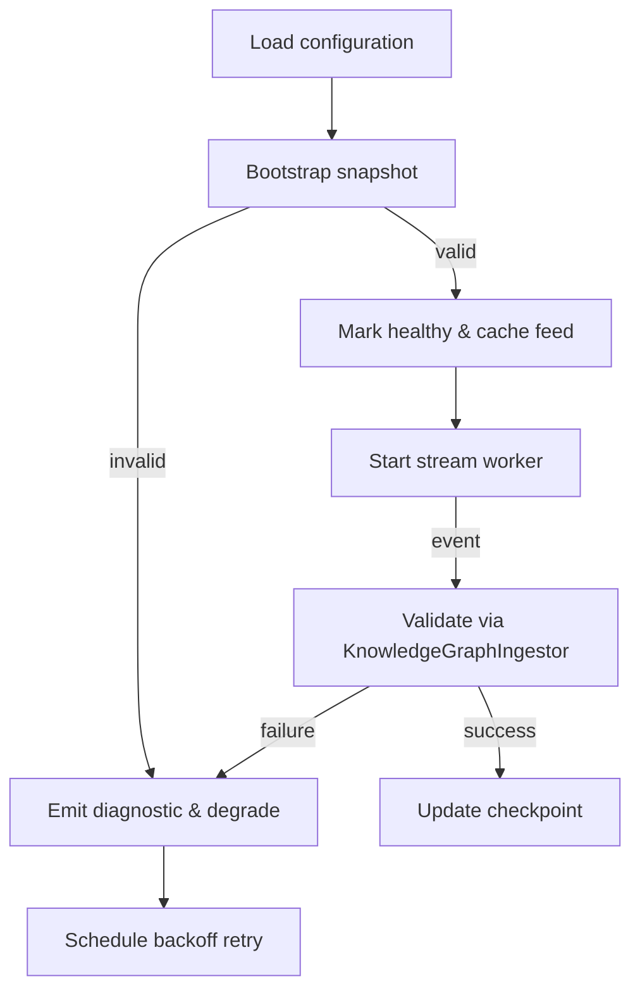

# KnowledgeFeedManager (Layer 4)

## Source Mapping
- Implementation: [`packages/server/src/features/knowledge/knowledgeFeedManager.ts`](../../../packages/server/src/features/knowledge/knowledgeFeedManager.ts)
- Parent design: [Knowledge Graph Ingestion Architecture](../../layer-3/knowledge-graph-ingestion.mdmd.md)
- Spec references: [FR-015](../../../specs/001-link-aware-diagnostics/spec.md#functional-requirements), [FR-016](../../../specs/001-link-aware-diagnostics/spec.md#functional-requirements), [T040](../../../specs/001-link-aware-diagnostics/tasks.md)

## Responsibility
Coordinates external knowledge feeds: loading snapshots, streaming deltas, tracking health status, and exposing currently healthy feeds to the `ArtifactWatcher`/`LinkInferenceOrchestrator`. Applies backoff and recovery per the feed resilience strategy.

## Key Concepts
- **FeedConfiguration**: Structured descriptor (id, snapshot loader, stream iterator, auth metadata) derived from workspace settings.
- **Healthy feeds cache**: In-memory map from feed ID to `KnowledgeFeed` descriptor handed to the orchestrator.
- **Backoff policy**: Exponential schedule (e.g., 1s → 5s → 25s → 2m) capped at configurable ceiling.
- **Observers**: Event emitter notifying runtime when health status changes (for diagnostics + watcher refresh).

## Public API
- `constructor(options: KnowledgeFeedManagerOptions)`
- `start(): Promise<void>` – bootstrap snapshots, launch stream workers.
- `stop(): Promise<void>` – cancel timers, close streams, flush checkpoints.
- `getHealthyFeeds(): KnowledgeFeed[]`
- `onStatusChanged(listener: (summary: FeedStatusSummary) => void): Disposable`

## Internal Flow

## Error Handling
- Snapshot validation failure → status "degraded", diagnostic emitted via gateway, retry on next poll.
- Stream error (transport/validation) → cancel worker, mark degraded, request fresh snapshot before restart.
- Unhandled errors bubble to logger and increment feed error metrics.

## Observability Hooks
- Structured logging (`info/warn/error`) for lifecycle events.
- Diagnostics updated through `FeedDiagnosticsGateway` on status transitions.
- Future telemetry: measure snapshot latency, stream throughput.

## Current Implementation Notes
- Feed configuration is currently bootstrapped from static JSON descriptors under `data/knowledge-feeds/`. Each descriptor supplies a KnowledgeSnapshot that binds Layer 4 documentation to its corresponding implementation files. This keeps the runtime self-hosting while we evolve dynamic feed discovery.
- Snapshot loaders re-read the JSON source on every initialization so updates to the descriptors propagate without requiring a server restart.
