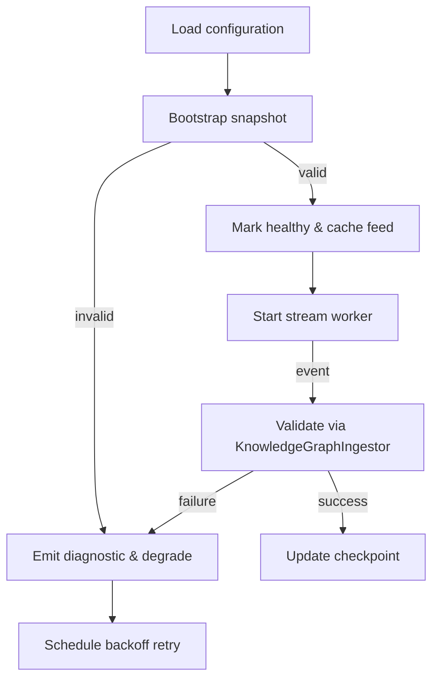

# KnowledgeFeedManager (Layer 4)

## Source Mapping
- Implementation: [`packages/server/src/features/knowledge/knowledgeFeedManager.ts`](../../../packages/server/src/features/knowledge/knowledgeFeedManager.ts)
- Parent design: [Knowledge Graph Ingestion Architecture](../../layer-3/knowledge-graph-ingestion.mdmd.md)
- Spec references: [FR-015](../../../specs/001-link-aware-diagnostics/spec.md#functional-requirements), [FR-016](../../../specs/001-link-aware-diagnostics/spec.md#functional-requirements), [T040](../../../specs/001-link-aware-diagnostics/tasks.md)

## Exported Symbols

### `Disposable`
Simple interface with a `dispose` method. Returned by `onStatusChanged` so listeners can unsubscribe from feed health notifications.

### `KnowledgeFeedManagerLogger`
Shape for optional logger dependencies supplying `info`, `warn`, and `error`. Allows host environments to plug in structured logging without hard-coding transports.

### `FeedSnapshotSource`
Descriptor for loading initial snapshots: includes a label and async loader returning an `ExternalSnapshot`.

### `FeedStreamSource`
Descriptor for stream ingestion, exposing a label and iterator that yields `ExternalStreamEvent`s. Supports lazy async construction of stream iterables.

### `FeedConfiguration`
Per-feed configuration assembled from runtime settings: identifiers plus optional snapshot/stream descriptors and metadata bag.

### `BackoffOptions`
Tuning knobs for the exponential backoff (initial delay, multiplier, maximum). Passed to internal backoff helper.

### `KnowledgeFeedManagerOptions`
Constructor arguments bundling feed configurations, the `KnowledgeGraphIngestor`, diagnostics gateway, optional logger, backoff settings, and clock override.

### `KnowledgeFeedManager`
Coordinator class that boots configured feeds, ingests snapshots, consumes stream events with backoff/retry, maintains healthy feed descriptors, and notifies observers of status changes.

## Responsibility
Coordinates external knowledge feeds: loading snapshots, streaming deltas, tracking health status, and exposing currently healthy feeds to the `ArtifactWatcher`/`LinkInferenceOrchestrator`. Applies backoff and recovery per the feed resilience strategy.

## Internal Flow

## Error Handling
- Snapshot validation failure → status "degraded", diagnostic emitted via gateway, retry on next poll.
- Stream error (transport/validation) → cancel worker, mark degraded, request fresh snapshot before restart.
- Unhandled errors bubble to logger and increment feed error metrics.

## Observability Hooks
- Structured logging (`info/warn/error`) for lifecycle events.
- Diagnostics updated through `FeedDiagnosticsGateway` on status transitions.
- Future telemetry: measure snapshot latency, stream throughput.

## Current Implementation Notes
- Feed configuration is currently bootstrapped from static JSON descriptors under `data/knowledge-feeds/`. Each descriptor supplies a KnowledgeSnapshot that binds Layer 4 documentation to its corresponding implementation files. This keeps the runtime self-hosting while we evolve dynamic feed discovery.
- Snapshot loaders re-read the JSON source on every initialization so updates to the descriptors propagate without requiring a server restart.
