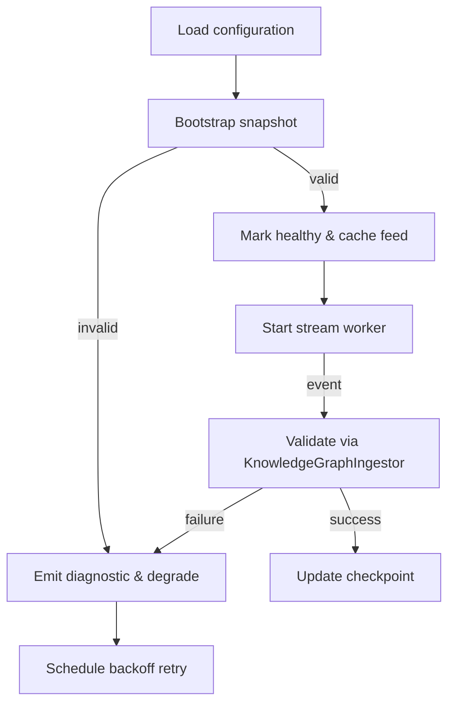

# KnowledgeFeedManager (Layer 4)

## Source Mapping
- Implementation: [`packages/server/src/features/knowledge/knowledgeFeedManager.ts`](../../../packages/server/src/features/knowledge/knowledgeFeedManager.ts)
- Parent design: [Knowledge Graph Ingestion Architecture](../../layer-3/knowledge-graph-ingestion.mdmd.md)
- Spec references: [FR-015](../../../specs/001-link-aware-diagnostics/spec.md#functional-requirements), [FR-016](../../../specs/001-link-aware-diagnostics/spec.md#functional-requirements), [T040](../../../specs/001-link-aware-diagnostics/tasks.md)

## Exported Symbols

#### Disposable
The `Disposable` interface exposes a dispose method and is returned by the onStatusChanged listener registration so observers can unsubscribe from feed health notifications.

#### KnowledgeFeedManagerLogger
The `KnowledgeFeedManagerLogger` interface defines optional logger dependencies supplying info, warn, and error hooks so hosts can plug in structured logging without hard-coding transports.

#### FeedSnapshotSource
The `FeedSnapshotSource` descriptor identifies how to load initial snapshots, providing a label and async loader that returns an external snapshot payload.

#### FeedStreamSource
The `FeedStreamSource` descriptor exposes a label and iterator that yields external stream events, supporting lazy async construction of stream iterables.

#### FeedConfiguration
The `FeedConfiguration` interface captures per-feed settings: identifiers plus optional snapshot and stream descriptors with metadata.

#### BackoffOptions
The `BackoffOptions` shape carries tuning knobs for exponential backoff (initial delay, multiplier, maximum) used by the internal scheduler.

#### KnowledgeFeedManagerOptions
The `KnowledgeFeedManagerOptions` interface bundles feed configurations, the knowledge graph ingestor, diagnostics gateway, optional logger, backoff settings, and clock override.

#### KnowledgeFeedManager
The `KnowledgeFeedManager` class coordinates feeds, ingests snapshots, consumes stream events with backoff and retry, maintains healthy feed descriptors, and notifies observers of status changes.

## Responsibility
Coordinates external knowledge feeds: loading snapshots, streaming deltas, tracking health status, and exposing currently healthy feeds to the `ArtifactWatcher`/`LinkInferenceOrchestrator`. Applies backoff and recovery per the feed resilience strategy.

## Internal Flow

## Error Handling
- Snapshot validation failure → status "degraded", diagnostic emitted via gateway, retry on next poll.
- Stream error (transport/validation) → cancel worker, mark degraded, request fresh snapshot before restart.
- Unhandled errors bubble to logger and increment feed error metrics.

## Observability Hooks
- Structured logging (`info/warn/error`) for lifecycle events.
- Diagnostics updated through `FeedDiagnosticsGateway` on status transitions.
- Future telemetry: measure snapshot latency, stream throughput.

## Current Implementation Notes
- Feed configuration is currently bootstrapped from static JSON descriptors under `data/knowledge-feeds/`. Each descriptor supplies a KnowledgeSnapshot that binds Layer 4 documentation to its corresponding implementation files. This keeps the runtime self-hosting while we evolve dynamic feed discovery.
- Snapshot loaders re-read the JSON source on every initialization so updates to the descriptors propagate without requiring a server restart.
