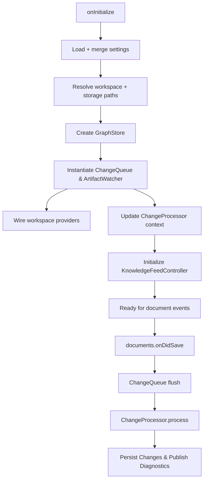

# Language Server Runtime Bootstrap (Layer 4)

## Source Mapping
- Implementation: [`packages/server/src/main.ts`](../../../packages/server/src/main.ts)
- Supporting modules:
  - [`packages/server/src/runtime/changeProcessor.ts`](../../../packages/server/src/runtime/changeProcessor.ts)
  - [`packages/server/src/runtime/environment.ts`](../../../packages/server/src/runtime/environment.ts)
  - [`packages/server/src/runtime/knowledgeFeeds.ts`](../../../packages/server/src/runtime/knowledgeFeeds.ts)
  - [`packages/server/src/runtime/settings.ts`](../../../packages/server/src/runtime/settings.ts)
- Parent design: _Language Server Architecture (Layer 3 – pending formal doc)_
- Spec references: [FR-002](../../../specs/001-link-aware-diagnostics/spec.md#functional-requirements), [FR-003](../../../specs/001-link-aware-diagnostics/spec.md#functional-requirements), [FR-008](../../../specs/001-link-aware-diagnostics/spec.md#functional-requirements), [FR-012](../../../specs/001-link-aware-diagnostics/spec.md#functional-requirements), [FR-015](../../../specs/001-link-aware-diagnostics/spec.md#functional-requirements)

## Responsibility
Owns the language server bootstrap loop: wiring LSP lifecycle events, projecting workspace settings into runtime configuration, coordinating change ingestion through `ArtifactWatcher`, and delegating diagnostics/knowledge-feed orchestration to dedicated services. The module guarantees that downstream processors always see a coherent context (graph store, runtime throttles, noisy feed signals) before responding to client requests.

## Key Concepts
- **Provider Guard** – merges extension initialization data with test overrides, blocks diagnostics when providers are misconfigured, and exposes the authoritative `ExtensionSettings` snapshot.
- **Runtime Settings Derivation** – converts provider guard output into debounce + noise-suppression knobs shared between change queue, diagnostics publishers, and knowledge feeds.
- **Change Queue** – debounced dispatcher that batches `TextDocument` saves into the asynchronous `ChangeProcessor` pipeline.
- **Change Processor Context** – shared state for inference, persistence, and diagnostic publication; updated whenever graph store, watcher, or runtime settings change.
- **Knowledge Feed Controller** – lifecycle manager for `KnowledgeGraphBridgeService`, ensuring healthy feeds are reflected into the `ArtifactWatcher` while respecting storage/backoff constraints.
- **Workspace Providers** – composed symbol/workspace index providers registered with the watcher to seed relationship hints during inference.

## Public API Surfaces
- `connection.onInitialize` – performs workspace discovery, storage bootstrap, and service wiring (change queue, watcher, knowledge feeds).
- `connection.onDidChangeConfiguration` / `SETTINGS_NOTIFICATION` – synchronize client-driven configuration changes and refresh runtime settings.
- `connection.onNotification(FILE_DELETED|FILE_RENAMED)` – propagate file system events to the maintenance subsystem.
- `connection.onRequest(OVERRIDE_LINK_REQUEST)` – apply manual dependency overrides with graph store persistence.
- `connection.onRequest(INSPECT_DEPENDENCIES_REQUEST)` – surface dependency graph snapshots for the client.
- `documents.onDidSave` – enqueue persisted document/code changes for batch processing.
- `syncRuntimeSettings()` – recompute runtime parameters, update the change queue + change processor, and re-initialize knowledge feeds when thresholds shift.

## Internal Flow

## Error Handling
- Initialization guards return early when graph store or watcher setup fails, preventing downstream processors from running in a partially configured state.
- `ChangeProcessor` logs and aborts batches when inference produces exceptions while still tracking skipped artifacts.
- Knowledge feed initialization disposes previous services before recreating them and degrades gracefully when storage directories are unavailable.
- Override and inspection requests throw explicit errors when the graph store has not been initialised, keeping client interactions predictable.

## Observability Hooks
- Structured logging across lifecycle operations (`info/warn/error`) with explicit change counts and diagnostic emission summaries.
- Knowledge feed status updates bubble through the controller to refresh watcher feeds and emit status traces.
- Runtime setting updates log the active debounce window and noise suppression level for benchmarking noise-control tuning.

## Current Implementation Notes
- Splitting helpers into `runtime/*` modules keeps `main.ts` below the 500-line threshold and enables targeted unit tests for settings derivation, environment resolution, change processing, and knowledge feed lifecycle management.
- `syncRuntimeSettings` now rehydrates both the change queue and knowledge feed controller, aligning debounce/noise configuration across diagnostics and external feed ingestion.
- The language server registers for `workspace/didChangeConfiguration` in `onInitialized` so that client-driven setting changes can be observed without additional manual plumbing.
- Future work: layer-3 documentation should codify the broader language server architecture, building on this runtime bootstrap contract.
