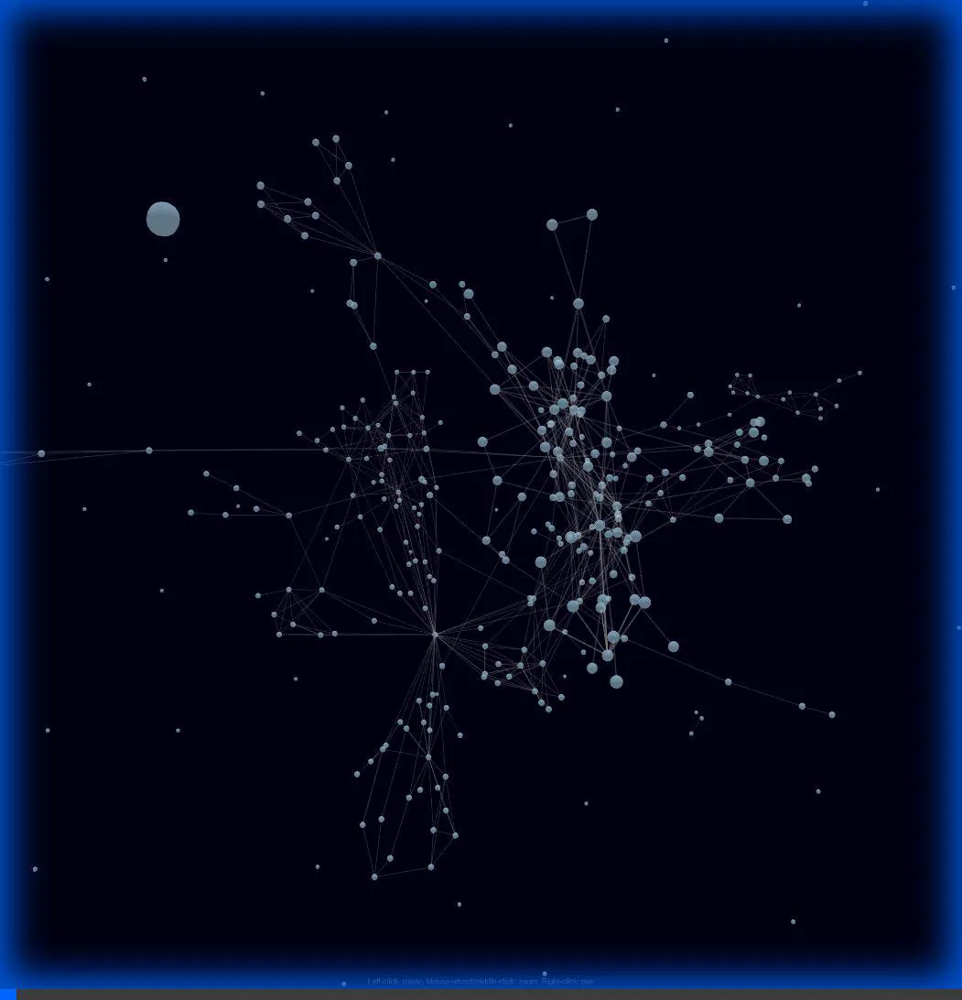
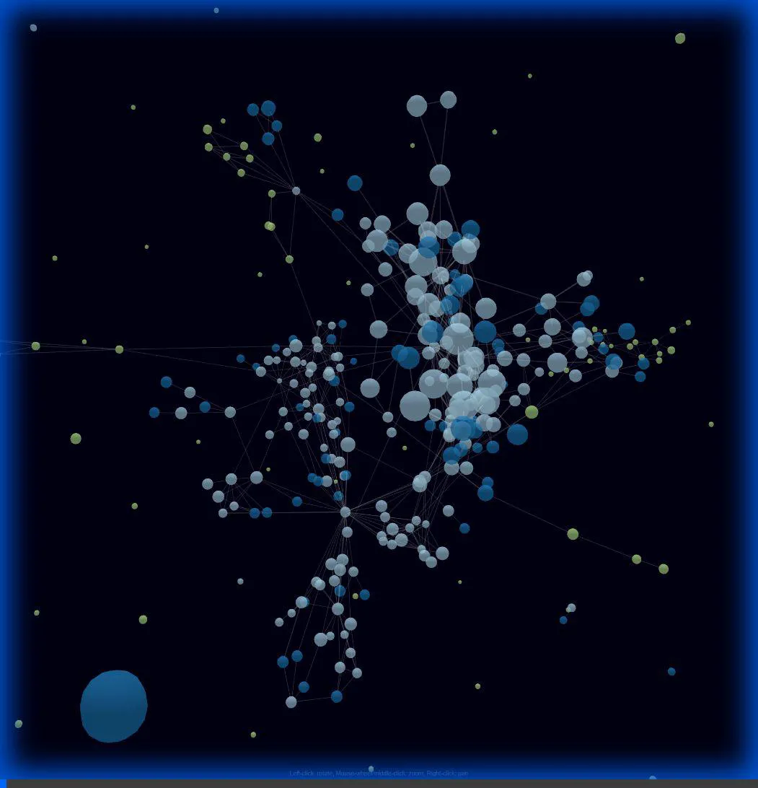

# Walkthrough - Visual Graph Explorer

I have successfully implemented and verified the **Visual Graph Explorer**.

## Verification Results

### Visual Inspection
I launched a browser agent to visit the local server (`http://localhost:59031`) and interact with the graph.
-   **Navigation**: Successful.
-   **Rendering**: The 3D graph rendered correctly.
-   **Interaction**: Nodes were clickable, and the camera rotated smoothly.

### Agent "Vision" Demonstration
You asked how I can "see" this. The video below demonstrates my browser tool in action, navigating and exploring the graph just like a user would.

### Analysis Capabilities
Beyond "seeing" the pixels, I can also "analyze" the graph by reading the raw JSON data that powers it. This allows me to answer questions like:
-   "What is the most connected node?"
-   "What is the shortest path between A and B?"
-   "Which files are completely isolated?"

## Refinement: "High Intensity" Induced Graph

You asked to "clean up the graph" and show "high intensity" connections between Live Documentation nodes.

### The Solution: Induced Links
Since Layer 4 documents don't always link to each other directly (they link to the code they document), I implemented an **"Induced Graph"** algorithm:
1.  **Filter**: Keep *only* Layer 4 MDMD files (the "mirrored simplified surface").
2.  **Project**: If `Doc A` covers `Code A` and `Doc B` covers `Code B`, and `Code A` imports `Code B`...
3.  **Induce**: ...I create a synthetic link `Doc A -> Doc B`.

### Result
The graph is now much cleaner (no raw code files) but highly connected. The "intensity" of connections is visualized by **thicker lines** and **more particles** flowing between nodes.

## Refinement: Color by Archetype, Size by Line Count

You asked to visualize more data:
-   **Color**: Group nodes by their `archetype` (e.g., `implementation`, `test`, `interface`).
-   **Size**: Scale nodes by the **line count** of their source code.

### The Solution: Metadata Enrichment
I updated the script to:
1.  **Parse MDMD**: Read the `Archetype` from the metadata of each Live Doc.
2.  **Read Source**: Follow the `Code Path` link, read the actual source file, and count the lines.
3.  **Visualize**:
    -   `nodeAutoColorBy('group')` uses the extracted archetype.
    -   `val` property is set to `Math.sqrt(lineCount)` for balanced sizing.

### Result
You can now instantly see:
-   **Big Nodes**: Complex files (lots of code).
-   **Small Nodes**: Simple files or interfaces.
-   **Colors**: Distinct groups for tests vs. implementation.

