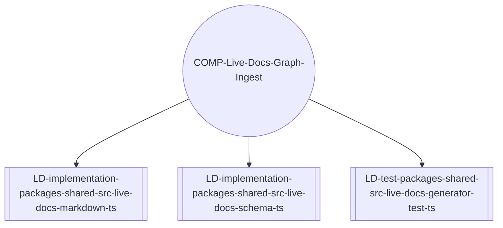
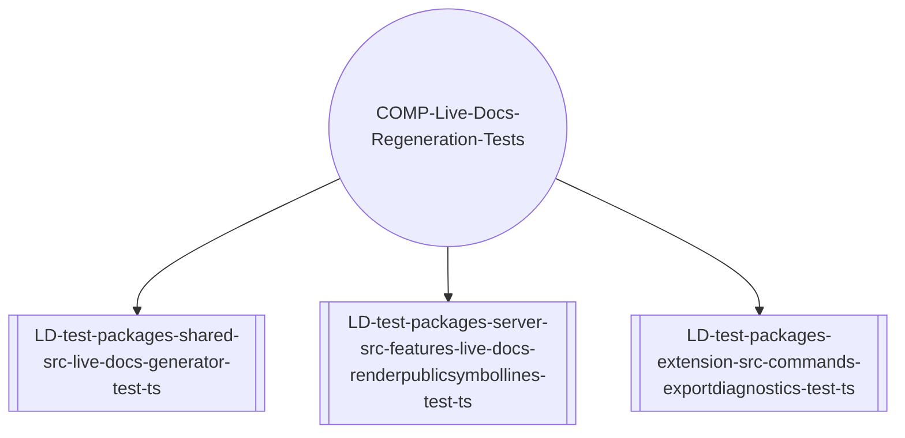
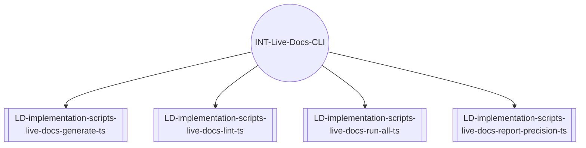
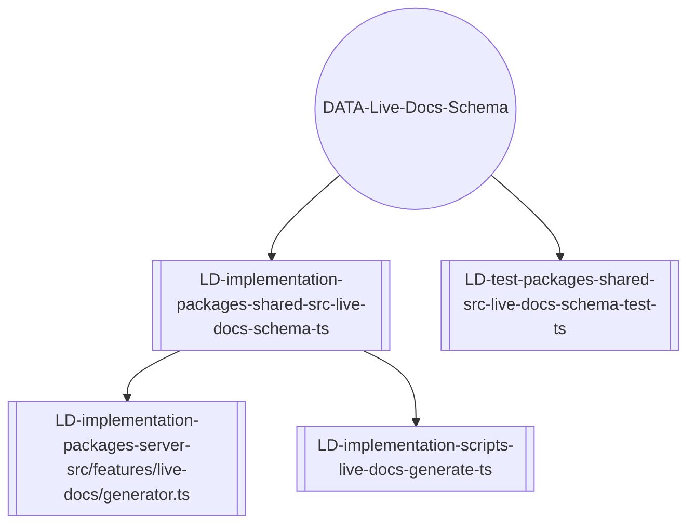
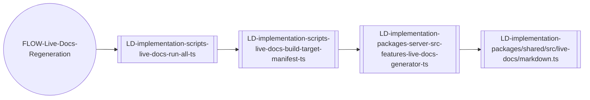
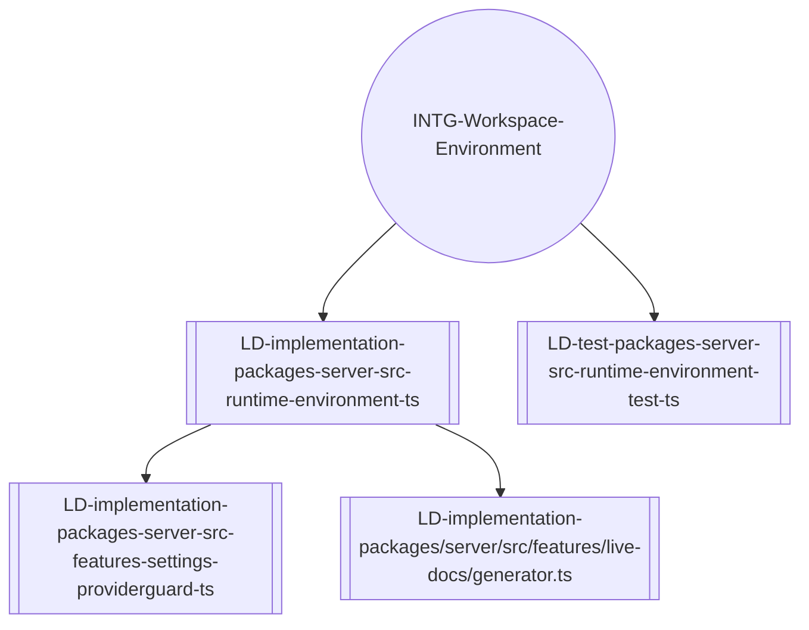

# MDMD Layer Content Census (Temporary)

Compiled 2025-11-10 to surface every chat-sourced description of MDMD or Live Documentation layers. Citations reference `AI-Agent-Workspace/ChatHistory/*.md` line ranges so the source guidance stays auditable.

## Worked Example – Markdown Polyglot AST Chain (2025-11-10)

This mock chain mirrors the "workspace-wide markdown AST" capability while enforcing adjacency-only links. Each layer lists only the layer immediately below it; no document links upward.

- `/.live-documentation/layer-1/capabilities/cap-workspace-polyglot-ast.md`
- `/.live-documentation/layer-2/requirements/req-live-docs-sync.md`
- `/.live-documentation/layer-3/components/comp-live-docs-graph-ingest.md`
- `/.mdmd/layer-4/packages/shared/src/live-docs/markdown.ts.mdmd.md`

### Layer 1 – CAP-Workspace-Polyglot-AST (concept)

```markdown
# CAP-Workspace-Polyglot-AST – Workspace Markdown AST Mirror

## Metadata
- Layer: 1
- Archetype: capability
- Live Doc ID: CAP-workspace-polyglot-ast

## Authored
### Intent
- Promise that every tracked artifact emits a deterministic markdown representation that tools and people can consume interchangeably.

### Signals
- Publish workspace-wide AST mirror as part of every quarterly release.
- Maintain CI regeneration success above 95 % across supported workspaces.

## Generated
### Completion Snapshot
- Requirements satisfied: 1 / 2 (50 %).
- Last Layer-2 update: 2025-11-09T22:40Z.

### Evidence Snapshot
- Latest public demo link: `docs/releases/2025-11.md#polyglot-ast`

## Dependencies
- REQ-Live-Docs-Sync *(Layer-2 requirement; Stage-0 doc pending)*
```

### Layer 2 – REQ-Live-Docs-Sync (unit)

```markdown
# REQ-Live-Docs-Sync – CI Regenerates Workspace AST Mirror

## Metadata
- Layer: 2
- Archetype: requirement
- Live Doc ID: REQ-live-docs-sync

## Authored
### Requirement
- [x] CI must regenerate Stage-0 Live Docs within five minutes for workspaces under 5 000 files.
- [ ] Regeneration pipeline emits progress metrics for human review.

### Acceptance Criteria
- [x] Two successive dry runs yield identical markdown diffs.
- [ ] Regeneration telemetry reports duration and failure counts for promotion into Layer-1 signals.

### Evidence
- COMP-Live-Docs-Regeneration-Tests *(Layer-3 testing doc; Stage-0 mirror pending)* publishes passing status for the regeneration suite.

## Dependencies
- COMP-Live-Docs-Graph-Ingest *(Layer-3 component doc; Stage-0 mirror pending)*
- COMP-Live-Docs-Regeneration-Tests *(Layer-3 testing doc; Stage-0 mirror pending)*

## Generated
### Completion Snapshot
- Requirement checkboxes complete: 1 / 2.
- Acceptance criteria complete: 1 / 2.

### Linked Components
- COMP-Live-Docs-Graph-Ingest *(Layer-3 component doc; Stage-0 mirror pending)*
- COMP-Live-Docs-Regeneration-Tests *(Layer-3 testing doc; Stage-0 mirror pending)*

### Linked Evidence
- [reports/test-report.ast.md](../../reports/test-report.ast.md)
- logs/ci/live-docs-regen.log *(capture location proposed; file not yet versioned)*
```

### Layer 3 – COMP-Live-Docs-Graph-Ingest (concept)

```markdown
# COMP-Live-Docs-Graph-Ingest – Live Doc Graph Synchronizer

## Metadata
- Layer: 3
- Archetype: component
- Live Doc ID: COMP-live-docs-graph-ingest

## Authored
### Purpose
- Provide the canonical ingestion architecture that maps Stage-0 Live Docs into the workspace graph and exposes coverage telemetry.

### Notes
- Upstream dependency: REQ-Live-Docs-Sync *(Layer-2 requirement; Stage-0 doc pending).*
- Prefer incremental graph updates; full rebuild fallback must run in <10 minutes on reference hardware.

## Generated
### Components
- [`LD-implementation-packages-shared-src-live-docs-markdown-ts`](../../.mdmd/layer-4/packages/shared/src/live-docs/markdown.ts.mdmd.md)
- [`LD-implementation-packages-shared-src-live-docs-schema-ts`](../../.mdmd/layer-4/packages/shared/src/live-docs/schema.ts.mdmd.md)
- [`LD-test-packages-shared-src-live-docs-generator-test-ts`](../../.mdmd/layer-4/packages/shared/src/live-docs/generator.test.ts.mdmd.md)

### Topology *(generated from Layer-4 dependency graph)*

```

### Layer 4 – LD-implementation-packages-shared-src-live-docs-markdown-ts (unit)

```markdown
# packages/shared/src/live-docs/markdown.ts

## Metadata
- Layer: 4
- Archetype: implementation
- Code Path: packages/shared/src/live-docs/markdown.ts
- Live Doc ID: LD-implementation-packages-shared-src-live-docs-markdown-ts

## Authored
### Purpose
- Render deterministic Live Documentation files by combining preserved prose with generated sections and provenance markers.

### Notes
- Shares parsing helpers with `packages/shared/src/live-docs/markdown.js` to stay runtime compatible across Node and browser runtimes.

## Generated
### Public Symbols
- `renderLiveDocMarkdown`
- `renderBeginMarker`
- `composeLiveDocId`

### Dependencies
- [`schema.LiveDocMetadata`](../../.mdmd/layer-4/packages/shared/src/live-docs/schema.ts.mdmd.md)
- [`pathUtils.normalizeWorkspacePath`](../../.mdmd/layer-4/packages/shared/src/tooling/pathUtils.ts.mdmd.md)
```

### Layer 3 – COMP-Live-Docs-Regeneration-Tests (concept)

```markdown
# COMP-Live-Docs-Regeneration-Tests – Regeneration Testing Architecture

## Metadata
- Layer: 3
- Archetype: testing-architecture
- Live Doc ID: COMP-live-docs-regeneration-tests

## Authored
### Purpose
- Capture the regeneration testing architecture that verifies Stage-0 Live Docs stay deterministic across packages.

### Notes
- Upstream requirement: REQ-Live-Docs-Sync *(Layer-2 requirement; Stage-0 doc pending).*
- Ensure Vitest seed remains stable; flaky retries mask regressions.

## Generated
### Components
- [`LD-test-packages-shared-src-live-docs-generator-test-ts`](../../.mdmd/layer-4/packages/shared/src/live-docs/generator.test.ts.mdmd.md)
- [`LD-test-packages-server-src-features-live-docs-renderpublicsymbollines-test-ts`](../../.mdmd/layer-4/packages/server/src/features/live-docs/renderPublicSymbolLines.test.ts.mdmd.md)
- [`LD-test-packages-extension-src-commands-exportdiagnostics-test-ts`](../../.mdmd/layer-4/packages/extension/src/commands/exportDiagnostics.test.ts.mdmd.md)

### Topology

```

### Layer 3 – INT-Live-Docs-CLI (interaction)

```markdown
# INT-Live-Docs-CLI – Live Documentation CLI Surface

## Metadata
- Layer: 3
- Archetype: interaction
- Live Doc ID: INT-live-docs-cli

## Authored
### Purpose
- Describe the user-facing CLI entry points that regenerate, lint, and report on Live Docs.

### Notes
- Upstream requirement: REQ-Live-Docs-Sync *(Layer-2 requirement; Stage-0 doc pending).*
- CLI flags must remain stable across releases; semantic changes require Layer-1 release notes.

## Generated
### Commands
- [`scripts/live-docs/generate.ts`](../../.mdmd/layer-4/scripts/live-docs/generate.ts.mdmd.md)
- [`scripts/live-docs/lint.ts`](../../.mdmd/layer-4/scripts/live-docs/lint.ts.mdmd.md)
- [`scripts/live-docs/run-all.ts`](../../.mdmd/layer-4/scripts/live-docs/run-all.ts.mdmd.md)
- [`scripts/live-docs/report-precision.ts`](../../.mdmd/layer-4/scripts/live-docs/report-precision.ts.mdmd.md)

### Topology

```

### Layer 3 – DATA-Live-Docs-Schema (data model)

```markdown
# DATA-Live-Docs-Schema – Live Doc Metadata Schema

## Metadata
- Layer: 3
- Archetype: data-model
- Live Doc ID: DATA-live-docs-schema

## Authored
### Purpose
- Capture the canonical TypeScript schema describing Live Doc metadata, provenance, and generated sections.

### Notes
- Breaking changes to serialized schema must increment the `schemaVersion` constant and notify downstream pipelines.
- Upstream dependency: REQ-Live-Docs-Sync *(Layer-2 requirement; Stage-0 doc pending).*

## Generated
### Definitions
- [`packages/shared/src/live-docs/schema.ts`](../../.mdmd/layer-4/packages/shared/src/live-docs/schema.ts.mdmd.md)
- [`packages/shared/src/live-docs/schema.test.ts`](../../.mdmd/layer-4/packages/shared/src/live-docs/schema.test.ts.mdmd.md)

### Topology

```

### Layer 3 – FLOW-Live-Docs-Regeneration (workflow)

```markdown
# FLOW-Live-Docs-Regeneration – Regeneration Workflow

## Metadata
- Layer: 3
- Archetype: workflow
- Live Doc ID: FLOW-live-docs-regeneration

## Authored
### Purpose
- Describe the end-to-end regeneration pipeline from CLI invocation through server-side graph updates.

### Notes
- SLA: Complete regeneration within five minutes for workspaces under 5 000 files.
- Upstream requirement: REQ-Live-Docs-Sync *(Layer-2 requirement; Stage-0 doc pending).*

## Generated
### Stages
- [`scripts/live-docs/run-all.ts`](../../.mdmd/layer-4/scripts/live-docs/run-all.ts.mdmd.md)
- [`scripts/live-docs/build-target-manifest.ts`](../../.mdmd/layer-4/scripts/live-docs/build-target-manifest.ts.mdmd.md)
- [`packages/server/src/features/live-docs/generator.ts`](../../.mdmd/layer-4/packages/server/src/features/live-docs/generator.ts.mdmd.md)

### Topology

```

### Layer 3 – INTG-Workspace-Environment (integration)

```markdown
# INTG-Workspace-Environment – Workspace Path Integration Boundary

## Metadata
- Layer: 3
- Archetype: integration
- Live Doc ID: INTG-workspace-environment

## Authored
### Purpose
- Document how the language server resolves storage paths, normalises URIs, and interfaces with the host filesystem.

### Notes
- Depends on VS Code extension settings and must tolerate missing workspace folders.
- Upstream requirement: REQ-Live-Docs-Sync *(Layer-2 requirement; Stage-0 doc pending).*

## Generated
### Components
- [`packages/server/src/runtime/environment.ts`](../../.mdmd/layer-4/packages/server/src/runtime/environment.ts.mdmd.md)
- [`packages/server/src/runtime/environment.test.ts`](../../.mdmd/layer-4/packages/server/src/runtime/environment.test.ts.mdmd.md)
- [`packages/server/src/features/settings/providerGuard.ts`](../../.mdmd/layer-4/packages/server/src/features/settings/providerGuard.ts.mdmd.md)

### Topology

```

## Layer 1 – Vision / Capabilities
- Initial four-layer framing (Vision, Requirements, Architecture, Implementation) defines Layer 1 as high-level vision and user stories driving the rest of the stack. (`2025-10-16.md:L1-L32`)
- Layer 1 is treated as a "concept" layer exporting capabilities and success signals that downstream layers must satisfy; evidence is stakeholder confirmation and adoption metrics rather than code. (`2025-10-30.md:L420-L512`)
- Documentation should remain timeless: strip transient status dumps so Layer 1 focuses on invariant intent anchored by `Intent/Signals` sections. (`2025-10-30.md:L420-L452`)
- Release-oriented view: Layer 1 Live Docs could map one-to-one to releases, enumerating capabilities and requirements that cascade into Layer 2 work items while staying workspace-local (no external API calls). (`2025-11-08.md:L1144-L1185`)
- Capability terminology forms an explicit chain (CapabilityID → RequirementID → ComponentID → Implementation) to keep layers interoperable. (`2025-10-30.md:L420-L470`)
- [2025-11-10] Keep numeric layer identifiers but present the user-facing aliases “Capability/Commitment/System/Implementation” so docs stay approachable without renumbering. (`2025-11-10.md:L1222-L1245`)
- [2025-11-11] Target the Capability layer for public-facing surfaces (e.g., GitHub Pages) while keeping Implementation-layer docs durable and allowing System views to materialise on demand. (`2025-11-11.md:L1532-L1558`,`2025-11-11.md:L1878-L1895`)
- [2025-11-13] Standardise the product name as “Live Documentation” in Layer 1 narratives and plan to stage the future GitHub Pages experience under `docs/site/` so capabilities have a dedicated publication home. (`2025-11-13.md:L1771-L1784`,`2025-11-13.md:L1888-L1998`)
- [2025-11-15] Keep Layer 1–3 MDMD folders as the only authored sources; any public “handbook” must be a deterministic Astro projection that rewrites links without editing the markdown and treats `.live-documentation/` as the Layer 4 mirror. (`2025-11-15.md:L971-L1004`)
- [2025-11-15] Schedule the static-site projection alongside the CI/CD rollout so it precedes the hosted demo site but never replaces the offline extension experience. (`2025-11-15.md:L1014-L1044`)

## Layer 2 – Requirements / Work Items
- Classified as a "unit" layer: each Layer 2 doc corresponds to a concrete work item and must cite acceptance criteria, evidence, and links to the architecture and implementation that fulfil it. (`2025-10-30.md:L420-L512`)
- Symbol correctness goals: every Layer 2 requirement should link upward to Layer 1 capabilities and downward to Layer 3 components/Layer 4 implementations; missing links should register as lint. (`2025-10-30.md:L240-L320`)
- Future Live Documentation layers should allow one-to-one mapping between Layer 2 docs and imported work items (Azure DevOps, GitHub Issues), keeping verification local while allowing exports for review. (`2025-11-08.md:L1144-L1170`)
- Roadmap/plan rewrites on 2025-11-08 aligned Layer 2 terminology with the Live Documentation pivot to keep requirements synchronized with new generator behaviour. (`2025-11-09.md:L99-L130`)
- [2025-11-10] Treat Layer 2 as human-authored checklists; generated sections should only tally adjacent completion (requirements and acceptance criteria) to keep automation simple. (`2025-11-10.md:L728-L915`)
- [2025-11-10] Require each requirement doc to name a single upstream capability/release so Capability-layer rollups stay deterministic despite the deliberate upward link exception. (`2025-11-10.md:L1000-L1104`)
- [2025-11-11] Delegate commitments to Spec-Kit or issue trackers so Layer 2 documentation references those sources rather than duplicating ownership in Live Docs. (`2025-11-11.md:L1878-L1895`)

## Layer 3 – Architecture / Solution Components
- For complex subsystems, author Layer 3 architecture memos before implementation so future work can rely on documented data flow, failure handling, and dependencies. (`2025-10-20.md:L1676-L1744`)
- Layer 3 functions as a "concept" layer exporting named responsibilities, interfaces, and telemetry expectations that Layer 4 docs must cover; evidence includes referenced implementations and operational proof. (`2025-10-30.md:L420-L512`)
- Symbol correctness requirements: Layer 3 docs should link both upward (Layer 2 requirements) and downward (Layer 4 implementations), with tooling detecting orphaned architecture entries. (`2025-10-30.md:L240-L320`)
- Architecture documentation should record benchmark provenance and other shared systems so Layer 3 stays authoritative over cross-cutting assets. (`2025-11-01.md:L2881-L2920`)
- Emerging automation concept: use change-frequency statistics plus the Live Doc AST to derive Layer 3 groupings and visualizations (e.g., generated Mermaid diagrams). (`2025-11-08.md:L1144-L1185`)
- Maintain room for additional Live Documentation layers above the base so architecture views can be regenerated from Layer 4 data without abandoning MDMD conventions. (`2025-11-08.md:L800-L880`)
- Standardise System-layer archetypes (Component, Interaction/API, Data Model, Workflow, Integration, Testing) around authored `Purpose`/`Notes` and generated `Components`/`Topology` sections so Layer 2 can consume them consistently. (`2025-11-10.md:L1030-L1120`)
- [2025-11-10] Generate System-layer docs purely from Stage‑0 Live Docs—legacy `.mdmd` files serve only for validation—while deriving archetypes via deterministic signals (component clusters, CLI entry points, schema files, workflow stages, integration touchpoints, coverage manifests). (`2025-11-10.md:L1310-L1505`)
- [2025-11-10] Guarantee every Implementation-layer doc appears in at least one System doc, summarise ancillary tests, allow optional multi-sampled LLM review for ambiguous archetype splits, and model dynamic branching by first replicating the manual reasoning path. (`2025-11-10.md:L2392-L2404`)
- [2025-11-11] Treat System docs as ephemeral generative views: regenerate them via CLI, keep bad fixtures visible in tests until debt is cleared, and avoid tracking materialised copies in git. (`2025-11-11.md:L1532-L1558`)
- [2025-11-15] Dogfood `npm run live-docs:system` outputs before editing architecture so modularity proposals (extension harness vs headless CLI vs container runner) reflect the actual topology captured in the generated System docs. (`2025-11-15.md:L1102-L1175`)
- [2025-11-15] Capture lasting integration-testing and sandbox-fixture plans inside Layer 3 MDMD files instead of tweaking the ephemeral System doc mirrors; the published architecture is the versioned source of truth. (`2025-11-15.md:L1180-L1189`)

## Layer 4 – Implementation / Live Documentation Base
- [2025-11-08] Base Live Docs pair an authored `Purpose`/`Notes` block with generated `Public Symbols` and `Dependencies`, forming the markdown-as-AST backbone. (`2025-11-08.md:L268-L340`,`2025-11-08.md:L5603-L5618`)
- [2025-11-09] Regeneration tasks enforce the Purpose/Notes-only authored block, dropping legacy Description headings across the staged mirror. (`2025-11-09.md:L1236-L1321`)
- [2025-11-09] Live Doc IDs compose as `LD-<archetype>-<normalized-source-path>` so provenance stays deterministic across contributors (e.g., `LD-implementation-packages-shared-src-inference-linkinference-ts`). (`2025-11-08.md:L3073-L3110`)
- Live Docs must be grounded in real code: review the source and tests before updating authored notes to keep the mirror trustworthy. (`2025-11-09.md:L1210-L1220`)
- Public symbols in Layer 4 docs must reference the symbol name in backticks so graph audits can confirm coverage. (`2025-10-27.md:L1600-L1680`)
 [2025-11-12] Emit structured docstring content under deterministic `##### \`Symbol\` — Field` subsections so every recommended XML tag becomes uniquely addressable inside Layer 4 Live Docs. (`2025-11-12.md:L790-L840`)
 [2025-11-12] Expand the language-agnostic documentation schema to capture summaries, remarks, params/type params, returns/value, exceptions, examples, links, and raw fragments while surfacing unsupported tags for future tooling. (`2025-11-12.md:L880-L1338`)
- [2025-11-15] Retire legacy `.mdmd/layer-4` files—`.mdmd/layer-4/**/*.mdmd.md` now embodies Layer 4 and will be the feedstock for any downstream projection (Astro site, demo bundles, etc.). (`2025-11-15.md:L971-L1004`)
- [2025-11-15] Enforce `.md` as the Live Doc extension and add matching `*.instructions.md` guides so lint globs, CLI tooling, and instructions target the Stage‑0 outputs instead of `.mdmd.md`. (`2025-11-15.md:L1258-L1279`)

## Live Documentation Base Layer Mechanics
- Each Live Doc separates metadata, authored content, and generated sections, a pattern intended for reuse in higher layers. (`2025-11-08.md:L1144-L1185`)
- [2025-11-02] Enforce a first-line breadcrumb comment in commentable code files (`// mdmd-layer4: .mdmd/...#slug`) paired with matching doc anchors so Layer 4 maintains bidirectional links between source and Live Doc sections. (`2025-11-02.md:L239-L320`)
- Required generated sections: `Public Symbols` and `Dependencies`; optional analytics (for example, co-activation scores or inbound reference counts) can layer on later. (`2025-11-08.md:L268-L340`)
- Planned enhancements include linking generated targets to sibling Live Docs, stabilizing provenance timestamps, and adding orphan detection. (`2025-11-09.md:L5079-L5087`)
- Live Docs regeneration must preserve authored sections, and the Stage 0 mirror must be fully migrated before commits to avoid `.mdmd/` drift. (`2025-11-09.md:L1111-L1160`)

## Cross-Layer Linkage & Symbol Correctness Vision
- Vision calls for rules that ensure every layer references its neighbours (L1↔L2↔L3↔L4), with SlopCop-like tooling flagging missing links or orphaned docs. (`2025-10-30.md:L240-L320`)
- [2025-10-30] Symbol sections must expose exports via heading-form identifiers (`### CAP-### –`, `### REQ-### –`, `### COMP-### –`, `### IMP-### –`) instead of bullet lists so profiles can link across layers deterministically. (`2025-10-30.md:L626-L668`)
- Concept vs unit classification guides enforcement: concept layers export vocabulary/intent while unit layers export concrete artefacts and evidence. (`2025-10-30.md:L420-L512`)
- "Symbol Correctness Profiles" were proposed to encode the expected inbound/outbound references and section structure per layer. (`2025-10-30.md:L240-L512`)
- Tooling updates (instructions, audits, validators) should enforce required section spines per layer (`Intent/Signals`, `Requirement/Acceptance/Evidence/Links`, `Purpose/Responsibilities/Interfaces/Failure Modes/Telemetry`, `Source Mapping/Exports/Collaborators/Evidence`). (`2025-10-30.md:L420-L470`)
- [2025-11-10] Treat Layers 3/4 as the deterministic spine (machine-generated from Stage‑0 signals) and Layers 1/2 as curated intent documents with lightweight generated tallies so automation remains reproducible without suppressing stakeholder storytelling. (`2025-11-10.md:L1124-L1185`)
- [2025-11-11] Plan for Capability-layer publishing (e.g., GitHub Pages) while tightening System-layer regeneration so users consume the latest view without stale artefacts. (`2025-11-11.md:L1532-L1558`)
- [2025-11-13] Capture the stretch goal where Live Documentation supports bidirectional authoring: Layer 1/2/3 docs must describe feature-flagged round-trip tooling, preview/apply telemetry, and scratch scaffolding that syncs doc edits back into source docstrings. (`2025-11-13.md:L1513-L1565`)
- [2025-11-12] Cascade the structured docstring schema through Layer 1 capabilities, Layer 2 requirements, Layer 3 system memos, and the `001-link-aware-diagnostics` spec so planning artifacts and implementation stay in lockstep. (`2025-11-12.md:L1340-L1380`)

## Emerging Ideas for Upper Layers
- Potential Layer 1 Live Docs per release could track capabilities and requirements, forming the roadmap when aggregated. (`2025-11-08.md:L1144-L1162`)
- Layer 3 Live Docs might be generated from Layer 4 co-change statistics plus AST analysis, yielding deterministic architecture diagrams. (`2025-11-08.md:L1144-L1185`)
- Future layers should follow the same Metadata / Authored / Generated pattern for consistency and machine parsing. (`2025-11-08.md:L1144-L1185`)
- Retain CLI parity for any UI affordance so agents can traverse layers symmetrically. (`2025-11-08.md:L800-L860`)

## Tooling & Enforcement Notes
- Graph audits, SlopCop checks, and forthcoming symbol validators should treat MDMD sections as first-class nodes alongside code. (`2025-10-30.md:L240-L512`)
- Orphan detection for Live Docs ensures the Stage 0 mirror stays aligned with actual source assets. (`2025-11-09.md:L5079-L5087`)
- Maintaining lint/test pipelines (safe:commit, live-docs:lint) remains mandatory before promoting layer changes. (`2025-11-09.md:L1111-L1160`)
- Authored content must avoid fragile frontmatter unless tooling explicitly supports it, keeping markdown simple for analysis. (`2025-10-30.md:L420-L470`)
- [2025-11-11] Keep the CLI command catalog authoritative—update it whenever new scripts or behaviours ship so documentation and tooling stay in lockstep. (`2025-11-11.md:L2470-L2485`)

## Open Questions Captured in Chat
- What statistical signals (co-change frequency derived from deterministic inputs) are reliable enough to promote Layer 3 clusters automatically. (`2025-11-08.md:L1144-L1185`)
- Should every implementation Live Doc be required to link to at least one architecture doc once higher layers migrate, and how strict should lint be about that prerequisite. (`2025-10-30.md:L240-L320`)

---
This census should be regenerated as new directives land so upcoming work on Layers 1–3 and post-base Live Documentation remains grounded in stakeholder intent.
